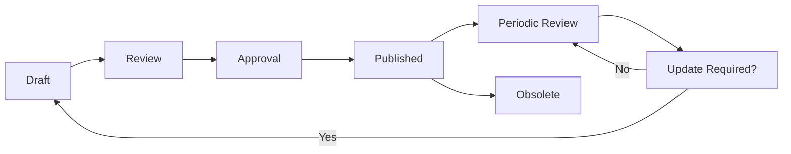

# Security Documentation Framework - Phase 1
**Project**: Taifabase Phase 1  
**Security Engineer**: Dr. Kenji Tanaka  
**Date**: 2025-10-03  
**Sprint**: 1, Day 1  
**Scope**: Comprehensive Security Documentation Structure

## Executive Summary

This framework establishes a comprehensive security documentation structure for Taifabase Phase 1, ensuring all security aspects are properly documented, maintained, and accessible for compliance, operations, and development teams.

## Documentation Architecture

### 1. Security Documentation Hierarchy

```
📁 /security/
├── 📁 policies/
│   ├── 📄 information-security-policy.md
│   ├── 📄 access-control-policy.md
│   ├── 📄 data-protection-policy.md
│   ├── 📄 incident-response-policy.md
│   └── 📄 security-training-policy.md
├── 📁 procedures/
│   ├── 📄 security-review-procedures.md
│   ├── 📄 vulnerability-management.md
│   ├── 📄 access-provisioning.md
│   └── 📄 security-monitoring.md
├── 📁 standards/
│   ├── 📄 coding-security-standards.md
│   ├── 📄 database-security-standards.md
│   ├── 📄 infrastructure-security-standards.md
│   └── 📄 encryption-standards.md
├── 📁 assessments/
│   ├── 📄 rls-security-evaluation-framework.md ✅
│   ├── 📄 multi-tenant-threat-model.md ✅
│   ├── 📄 security-risk-assessment.md
│   └── 📄 penetration-test-reports/
├── 📁 compliance/
│   ├── 📄 compliance-framework.md ✅
│   ├── 📄 gdpr-compliance-documentation.md
│   ├── 📄 soc2-controls-documentation.md
│   └── 📄 audit-evidence/
├── 📁 architecture/
│   ├── 📄 security-architecture-overview.md
│   ├── 📄 network-security-design.md
│   ├── 📄 data-flow-security-analysis.md
│   └── 📄 authentication-authorization-design.md
├── 📁 operations/
│   ├── 📄 security-monitoring-runbook.md
│   ├── 📄 incident-response-playbook.md
│   ├── 📄 backup-recovery-security.md
│   └── 📄 security-maintenance-schedule.md
├── 📁 testing/
│   ├── 📄 rls-security-testing-strategy.md ✅
│   ├── 📄 automated-security-testing.md
│   ├── 📄 penetration-testing-methodology.md
│   └── 📄 security-test-results/
└── 📁 training/
    ├── 📄 security-awareness-training.md
    ├── 📄 secure-development-training.md
    ├── 📄 incident-response-training.md
    └── 📄 compliance-training.md
```

## Document Templates and Standards

### 1. Policy Document Template

```markdown
# [Policy Name]
**Document Type**: Security Policy  
**Version**: 1.0  
**Owner**: Dr. Kenji Tanaka (Security Engineer)  
**Approved By**: [Approver Name]  
**Effective Date**: [Date]  
**Review Date**: [Date + 1 year]  
**Classification**: Internal

## Purpose
[Clear statement of policy purpose and objectives]

## Scope
[Who and what this policy applies to]

## Policy Statement
[High-level policy statements]

## Responsibilities
[Roles and responsibilities for policy implementation]

## Compliance
[Regulatory and legal requirements]

## Enforcement
[Consequences of policy violations]

## Related Documents
[Links to related policies, procedures, and standards]

## Revision History
| Version | Date | Author | Changes |
|---------|------|--------|---------|
| 1.0 | [Date] | [Author] | Initial version |
```

### 2. Procedure Document Template

```markdown
# [Procedure Name]
**Document Type**: Security Procedure  
**Version**: 1.0  
**Owner**: [Procedure Owner]  
**Last Updated**: [Date]  
**Review Frequency**: Quarterly  
**Classification**: Internal

## Purpose
[Why this procedure exists]

## Scope
[When and where this procedure applies]

## Prerequisites
[Required knowledge, tools, access]

## Procedure Steps
### Step 1: [Action]
- **Responsible Party**: [Role]
- **Description**: [Detailed steps]
- **Tools Required**: [List tools]
- **Expected Outcome**: [What should happen]

## Escalation
[When and how to escalate issues]

## Quality Assurance
[How to verify procedure completion]

## Related Documents
[Links to policies, standards, other procedures]
```

### 3. Technical Standard Template

```markdown
# [Standard Name]
**Document Type**: Technical Security Standard  
**Version**: 1.0  
**Technical Owner**: [Owner Name]  
**Stakeholders**: [List stakeholders]  
**Last Updated**: [Date]  
**Classification**: Internal

## Overview
[Purpose and scope of standard]

## Requirements
### Mandatory Requirements
- [Requirement 1]
- [Requirement 2]

### Recommended Requirements
- [Recommendation 1]
- [Recommendation 2]

## Implementation Guidelines
[How to implement these requirements]

## Validation Methods
[How to verify compliance]

## Exceptions
[When exceptions are allowed and approval process]

## Related Standards
[Links to related technical standards]
```

## Core Security Documents

### 1. Information Security Policy

```markdown
# Information Security Policy
**Document Type**: Security Policy  
**Version**: 1.0  
**Owner**: Dr. Kenji Tanaka  
**Effective Date**: 2025-10-03  
**Review Date**: 2026-10-03  

## Purpose
This policy establishes the foundation for protecting Taifabase's information assets and ensuring the confidentiality, integrity, and availability of customer and company data.

## Scope
This policy applies to all employees, contractors, vendors, and users of Taifabase systems and data.

## Policy Statements

### Data Protection
- All customer data must be protected according to the principle of least privilege
- Multi-tenant data isolation must be maintained at all times
- Personal data must be processed in accordance with GDPR requirements

### Access Control
- User access must be granted based on business need and role requirements
- Privileged access must be monitored and audited
- Regular access reviews must be conducted quarterly

### Security by Design
- Security controls must be implemented from the initial design phase
- All systems must undergo security review before production deployment
- Threat modeling must be conducted for new features and systems

### Incident Response
- Security incidents must be reported within 1 hour of discovery
- Data breaches must be assessed for notification requirements within 24 hours
- All incidents must be documented and reviewed for lessons learned

## Compliance Requirements
- GDPR compliance for all personal data processing
- SOC2 Type II compliance for customer trust
- Industry security best practices and standards

## Enforcement
Violations of this policy may result in disciplinary action, including termination of employment or contract.
```

### 2. Database Security Standards

```markdown
# Database Security Standards
**Document Type**: Technical Security Standard  
**Version**: 1.0  
**Technical Owner**: Dr. Kenji Tanaka  
**Stakeholders**: Backend Engineers, DevOps Engineers  

## Overview
This standard defines mandatory security requirements for all database systems in Taifabase infrastructure.

## Mandatory Requirements

### Authentication and Access Control
- All database connections must use strong authentication
- Role-based access control (RBAC) must be implemented
- Principle of least privilege must be enforced
- Default database accounts must be disabled or secured

### Row Level Security (RLS)
- RLS must be enabled on all multi-tenant tables
- FORCE ROW LEVEL SECURITY must be configured
- RLS policies must be reviewed and tested quarterly
- Policy modifications require security team approval

### Encryption
- All data in transit must be encrypted with TLS 1.2 or higher
- Database connections must enforce SSL/TLS
- Sensitive data at rest must be encrypted
- Encryption keys must be managed through approved key management systems

### Audit and Monitoring
- All database access must be logged
- Privileged operations must be audited
- Failed authentication attempts must be monitored
- Unusual access patterns must trigger alerts

### Backup and Recovery
- Database backups must be encrypted
- Backup integrity must be verified regularly
- Recovery procedures must be tested quarterly
- Backup access must be restricted and audited

## Implementation Guidelines

### PostgreSQL Specific Requirements
```sql
-- Enable audit logging
ALTER SYSTEM SET log_statement = 'all';
ALTER SYSTEM SET log_connections = 'on';
ALTER SYSTEM SET log_disconnections = 'on';

-- Force SSL connections
ALTER SYSTEM SET ssl = 'on';
ALTER SYSTEM SET ssl_cert_file = '/path/to/server.crt';
ALTER SYSTEM SET ssl_key_file = '/path/to/server.key';
```

### RLS Implementation Standard
```sql
-- Standard RLS policy pattern
CREATE POLICY [policy_name] ON [table_name]
    FOR ALL
    TO [role_name]
    USING (tenant_id = get_current_tenant());

-- Force RLS even for table owners
ALTER TABLE [table_name] FORCE ROW LEVEL SECURITY;
```

## Validation Methods
- Automated security scanning of database configurations
- Quarterly RLS policy testing
- Annual penetration testing of database security
- Regular compliance audits

## Exception Process
Exceptions to these standards require:
1. Written justification with risk assessment
2. Security team approval
3. Compensating controls implementation
4. Regular review of exception status
```

### 3. Incident Response Playbook

```markdown
# Security Incident Response Playbook
**Document Type**: Operational Procedure  
**Version**: 1.0  
**Owner**: Dr. Kenji Tanaka  
**Emergency Contact**: security@taifabase.com  

## Incident Classification

### Severity Levels
- **Critical**: Data breach, system compromise, complete service outage
- **High**: Potential data exposure, privilege escalation, partial service impact
- **Medium**: Security policy violation, suspicious activity, minor service impact
- **Low**: Security tool alerts, potential vulnerabilities, no immediate impact

## Response Procedures

### Phase 1: Detection and Analysis (0-1 hours)
1. **Incident Detection**
   - Monitor security alerts and notifications
   - Review user reports and system anomalies
   - Analyze security tool outputs

2. **Initial Assessment**
   - Classify incident severity
   - Determine scope and impact
   - Identify affected systems and data

3. **Notification**
   - Alert incident response team
   - Notify management for Critical/High incidents
   - Document initial findings

### Phase 2: Containment and Eradication (1-24 hours)
1. **Immediate Containment**
   - Isolate affected systems
   - Preserve evidence
   - Prevent lateral movement

2. **Investigation**
   - Analyze logs and forensic evidence
   - Determine attack vectors
   - Assess data exposure

3. **Eradication**
   - Remove malicious code or unauthorized access
   - Patch vulnerabilities
   - Strengthen security controls

### Phase 3: Recovery and Post-Incident (24+ hours)
1. **System Recovery**
   - Restore services from clean backups
   - Implement additional monitoring
   - Verify system integrity

2. **Post-Incident Review**
   - Conduct lessons learned session
   - Update security procedures
   - Implement preventive measures

## Database-Specific Incident Scenarios

### Scenario 1: Suspected Data Breach
**Indicators**: Cross-tenant data access, unauthorized privilege escalation

**Response Steps**:
1. Immediately review database audit logs
2. Check RLS policy effectiveness
3. Verify user access patterns
4. Assess data exposure scope
5. Implement additional access controls

### Scenario 2: RLS Policy Bypass
**Indicators**: Users accessing other tenant data, policy violations

**Response Steps**:
1. Verify RLS policy configuration
2. Check for privilege escalation
3. Review session management
4. Test policy effectiveness
5. Restore proper access controls

### Scenario 3: SQL Injection Attack
**Indicators**: Malicious SQL in logs, unexpected database behavior

**Response Steps**:
1. Identify injection points
2. Block malicious requests
3. Review application code
4. Implement input validation
5. Update security controls

## Evidence Collection
- Database audit logs
- System access logs
- Network traffic captures
- Application logs
- Security tool outputs

## Legal and Regulatory Considerations
- GDPR breach notification (72 hours)
- SOC2 incident reporting
- Customer notification requirements
- Law enforcement coordination (if required)

## Communication Templates
- Internal incident notification
- Customer communication
- Regulatory notification
- Public disclosure (if required)
```

## Document Management

### 1. Version Control
- All security documents must be version controlled
- Changes require approval from document owner
- Major changes require security team review
- Version history must be maintained

### 2. Access Control
- Security documents classified as Internal or Confidential
- Access granted based on role requirements
- Document sharing requires owner approval
- External sharing requires additional approval

### 3. Review Schedule
- Policies: Annual review
- Procedures: Quarterly review
- Standards: Semi-annual review
- Assessments: After significant changes
- Incident documentation: Immediate post-incident

### 4. Document Lifecycle


## Quality Assurance

### 1. Document Standards
- Use consistent templates and formatting
- Include all required metadata
- Maintain clear and concise language
- Provide actionable guidance

### 2. Review Process
- Technical accuracy review
- Legal and compliance review
- Stakeholder input and approval
- Final security team approval

### 3. Metrics and Monitoring
- Document usage statistics
- Review completion rates
- Update frequency tracking
- Compliance assessment results

## Integration with Team Workflows

### Marcus Rodriguez (Backend Engineering)
- Database security standards integration
- Secure coding procedure adoption
- Security review participation

### Aisha Kamau (QA Engineering)
- Security testing procedure integration
- Vulnerability assessment coordination
- Test documentation standards

### Raj Patel (DevOps Engineering)
- Infrastructure security standards
- Monitoring and alerting procedures
- Incident response coordination

## Success Metrics

### Documentation Coverage
- 100% of security domains covered
- All critical procedures documented
- Complete policy framework established

### Document Quality
- Regular review completion rate >95%
- Stakeholder satisfaction >90%
- Incident response effectiveness

### Compliance Support
- Audit evidence readily available
- Regulatory requirement coverage
- Control effectiveness documentation

## Implementation Timeline

### Phase 1 (Sprint 1): Foundation
- [x] Documentation framework established
- [x] Core security assessments completed
- [ ] Essential policies and procedures created

### Phase 2 (Sprint 2-3): Expansion
- [ ] Complete procedure documentation
- [ ] Operational runbooks developed
- [ ] Training materials created

### Phase 3 (Sprint 4+): Optimization
- [ ] Document automation implemented
- [ ] Advanced metrics and monitoring
- [ ] Continuous improvement process

This security documentation framework ensures comprehensive coverage of all security aspects while supporting compliance requirements and operational effectiveness.